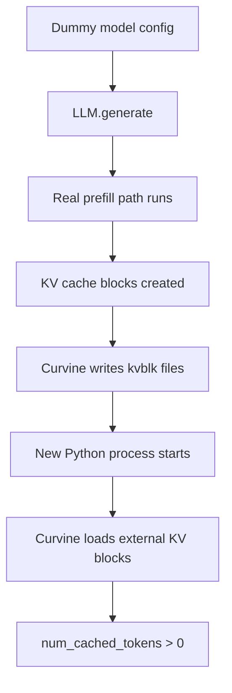

# Curvine Connector CPU PoC

本文总结了当前 vLLM 外部 KV 存储场景下的 Curvine 集成工作，方便后续贡献者在一个地方快速了解设计背景、当前实现状态、验证范围以及下一步计划。

!!! note
    当前工作仍然属于 PoC 阶段。目标是在进入生产级实现之前，先验证 connector 形态、存储抽象以及 block 序列化格式是否成立。

## 背景

当前方向是将 Curvine 适配为 vLLM 的外部 L2 KV 存储。

当前约定的实现路径如下：

1. 先做 PoC，而不是直接从 `OffloadingFirst` 开始。
2. 以 `KVConnectorBase_V1` 作为主要集成入口。
3. 先使用 Curvine FUSE 加 POSIX 文件 I/O，再保持清晰的抽象边界，方便后续把底层从 FUSE/POSIX 切换为 Curvine native client。
4. 一开始就使用稳定的 block 文件格式（`kvblk`），这样底层存储后端变化时不会影响 connector 语义。

在 vLLM 现有实现里，最接近的参考对象是 `HF3FSKVConnector`，因为它已经采用了外部文件型 KV connector 的模式。

## 设计目标

这个 PoC 主要验证三件事：

- vLLM 的 KV block 能否序列化成稳定的外部对象格式。
- scheduler 和 worker 两侧的 connector 生命周期能否通过 Curvine 后端完成 load 和 save。
- 当底层存储后端从 FUSE/POSIX 切换到 Curvine native client 时，connector 流程本身是否仍然成立。

这个 PoC 也明确不打算一次性解决所有问题：

- 不做生产级 metadata service。
- 不做复杂 manifest 层。
- 不做超出最小 connector 生命周期所需的异步传输流水线。
- 暂时不做真正的 GPU gather / scatter 路径。
- 暂时不保证多 rank / 多节点正确性。

## 当前架构

当前实现刻意拆成三层：

### `CurvineKVConnector`

这一层直接面对 vLLM。

主要职责：

- 实现 `KVConnectorBase_V1`。
- 基于 scheduler 侧的 block 状态构建 load / save plan。
- 触发 worker 侧的 save 和 load 操作。
- 将加载回来的 payload 注入到已注册的 KV cache 中。

当前实现位置：

- `vllm/distributed/kv_transfer/kv_connector/v1/curvine/connector.py`

### `kvblk`

这是 PoC 使用的稳定 block 序列化格式。

主要职责：

- 将一个逻辑 KV block 编码成一个二进制对象。
- 保留足够的 header 元数据，便于校验和未来兼容。
- 在不依赖底层存储后端的前提下，将字节流解码回 block payload。

当前实现位置：

- `vllm/distributed/kv_transfer/kv_connector/v1/curvine/kvblk.py`

### `CurvineStoreClient`

这是存储抽象层。

主要职责：

- 将 `block_key` 映射成底层存储对象路径。
- 提供 exists、read、write、delete 等操作。
- 屏蔽底层究竟是 POSIX/FUSE 还是未来的 Curvine native client。

当前实现位置：

- `vllm/distributed/kv_transfer/kv_connector/v1/curvine/store.py`

当前 PoC 的后端实现是 `PosixCurvineStoreClient`。

## `kvblk` V1 格式

当前 PoC 采用“一块一个文件”的方式存储 KV block，每个文件由定长 header 加原始 payload 字节组成。

V1 格式的重要属性包括：

- 每个 block 对应一个文件。
- 使用定长 header，方便快速校验。
- 当前 payload 直接存原始字节。
- 使用 CRC 校验 header 和 body。
- 在 payload 旁边保存 layout 和 dtype 元数据。

这个格式的设计目标是：

- `PosixCurvineStoreClient` 与未来的 Curvine native backend 可以共享完全相同的编码结果。
- 一旦校验失败，明确报为 load error，而不是静默读到脏数据。

## 当前对象布局

当前路径策略如下：

```text
<root>/<model_id>/<tp_rank>/<kv_group>/<hash_prefix>/<block_key>.kvblk
```

这样既能保持对象标识在不同后端中的稳定性，也能减少目录热点问题。

## 基础概念

为了方便看懂对象路径、header 字段和命中逻辑，这里先统一几个基础概念。

### `model_id`

- 表示当前这份外部 KV 数据属于哪个模型。
- 在当前 PoC 里，它会参与目录隔离，也会写进 `kvblk` header 的模型相关字段。
- 如果两个不同模型共用同一份外部路径，但 `model_id` 不同，它们的数据会自然隔离。

### `tp_rank`

- `tp_rank` 是 `Tensor Parallel Rank`，也就是 tensor parallel 切分后当前分片的编号。
- 如果模型没有做 tensor parallel，通常它就是 `0`。
- 如果模型被切成多份，比如 `tp_size=2`，那通常就会有 `tp_rank=0` 和 `tp_rank=1` 两个分片。
- 当前 PoC 把它放进目录路径和 `kvblk` header，目的是把不同 TP 分片的 KV 数据隔离开，避免互相覆盖。

可以把它理解成：

- `tp_rank=0`：第 0 份张量并行分片的数据
- `tp_rank=1`：第 1 份张量并行分片的数据

### `kv_group_id`

- `kv_group_id` 表示当前 KV 数据属于哪个 KV group。
- 在当前单卡、单组的 CPU PoC 里，它通常直接取 `0`。
- 后续如果一个模型运行时存在多个 KV cache group，就需要依赖它来继续做隔离。

### `block_key`

- `block_key` 是一个逻辑 KV block 的稳定标识。
- 当前实现里，它来自请求 block hash 的十六进制表示。
- 同一个 prompt 前缀在相同模型、相同布局、相同语义下，只要算出的 block hash 一样，对应的 `block_key` 就一样。
- 这也是外部存储命中的基础。

### `slot_mapping`

- `slot_mapping` 描述“本次真正需要写入或回填的是哪些 slot / token 位置”。
- 当前 PoC 在 load 路径上已经会利用它做部分 token scatter。
- save 路径上如果只覆盖了一个 block 的一部分 token，当前实现会保守地跳过持久化，避免写出不完整 block。

## 当前命中判定逻辑

当前 `Curvine` PoC 的“命中”不是靠复杂索引服务，而是靠一个非常直接的规则：

1. 先根据请求 prompt 计算出完整 block 的 `block_key` 列表。
2. 对这些 `block_key` 到外部存储做 `batch_exists()` 检查。
3. 从前往后统计“连续存在”的 block。
4. 一旦遇到第一个不存在的 block，就停止统计。
5. 把这段连续命中的前缀 block 作为可加载的外部 KV。

换句话说，当前命中语义是：

- 只看前缀连续命中。
- 不做“中间断了后面还能继续命中”的稀疏加载。
- 命中的本质依据就是：对应的外部 `kvblk` 文件已经存在。

从实现上看，核心逻辑就在 `CurvineKVConnector.get_num_new_matched_tokens()`：

- 它先计算 prompt 能组成多少个完整 block。
- 再把 block hash 转成 `block_key`。
- 然后对外部存储做存在性检查。
- 最后把“连续命中的 block 数 * block_size”作为 `matched_tokens` 返回给 scheduler。

这也意味着当前最基础、最可靠的命中前提是：

- 第二次请求的 prompt 前缀必须与第一次一致。
- 两次运行必须使用同一个 `model_id`、`tp_rank`、`kv_group_id` 和存储根目录。
- 第一次运行已经把对应前缀 block 成功写入外部存储。

## 当前 PoC 范围

当前 PoC 以 CPU 路径优先，并且按 layer 组织。

已经在范围内的能力：

- scheduler 侧 block 命中检测。
- scheduler 侧 load / save metadata 生成。
- worker 侧通过 `save_kv_layer` 保存 block。
- worker 侧通过 `start_load_kv` 和 `wait_for_layer_load` 加载 block。
- CPU tensor 的序列化与反序列化。
- 按 layer 隔离的存储 key。
- load 侧根据 `slot_mapping` 进行部分 token scatter。

暂时有意不做的能力：

- save 侧从离散 slot 中真正做 partial-token gather。
- 真正的 GPU gather / scatter。
- `wait_for_save()` 和 `get_finished()` 上完整的异步保存完成语义。
- 多 rank / 多卡验证。
- 面向大量小文件的真实 Curvine FUSE 压测。

## 当前工作边界

当前实现边界被刻意收得很窄：

- 只实现和验证 Curvine connector 这条路径本身。
- 变更尽量只聚焦 `curvine` connector 代码、它的存储格式以及定向测试。
- 除非 Curvine connector 自身无法推进，否则不要把工作扩展到无关的 vLLM 子系统、泛化的 shared-test 重构，或者整体代码清理。

对于 CPU 单元测试，当前推荐路径也同样保持收敛：

- 尽量使用本地最小 model config fixture 来支撑 connector 测试。
- 避免让 Curvine connector 的验证依赖外部 Hugging Face 网络访问。
- 默认优先走离线、connector 聚焦的测试路径；只有当 connector 逻辑本身确实要求时，才升级到更宽的 runtime 或 model-loading 范围。

## 实现状态

`vllm` 中已经实现的部分包括：

- `CurvineKVConnector` 已注册进 connector factory。
- `CurvineRequestMetadata` 和 `CurvineConnectorMetadata` 可以承载每个请求的 load / save plan。
- `save_kv_layer()` 已支持把原始 payload 和 CPU tensor 持久化为 `kvblk`。
- `start_load_kv()` 已能构建按 layer 组织的待加载队列。
- `wait_for_layer_load(layer_name)` 已能执行延迟的按层注入。
- store key 已按 layer 隔离，避免同一逻辑 block key 在不同 layer 上冲突。
- 损坏的 `kvblk` 对象会被当作 load failure 处理。

CPU 路径已经不止停留在简单的 bytes round-trip：

- 已支持从 CPU KV tensor 中完整提取 block。
- 已支持把 block 完整注入回已注册的 CPU KV cache。
- load 路径已经消费 `ForwardContext.slot_mapping[layer_name]`。
- 如果一次只请求某个 block 的部分 token，当前 PoC 只会把这些 token scatter 回去，而不会覆盖整个 block。
- 如果 save 侧的 `slot_mapping` 只覆盖了一个 block 的部分内容，当前 PoC 会跳过持久化，避免写入局部或脏 block。

## 当前测试

当前 Curvine PoC 由以下定向单元测试覆盖：

- `tests/v1/kv_connector/unit/test_curvine_kvblk.py`
- `tests/v1/kv_connector/unit/test_curvine_store.py`
- `tests/v1/kv_connector/unit/test_curvine_connector.py`

这些测试当前覆盖了：

- `kvblk` header 以及 encode / decode 行为。
- store 路径映射与 POSIX 读写行为。
- connector factory 注册。
- scheduler 侧匹配 block 计数。
- scheduler 侧 load / save metadata 生成。
- worker 侧通过 metadata 执行 save / load。
- CPU tensor block 提取与回灌。
- 损坏 block 的处理。
- 按 layer 隔离的 save / load 行为。
- 基于 `slot_mapping` 的 load 侧部分 token scatter。

## 如何测试

当前推荐的验证路径分为两层。

### 1. 离线、connector 聚焦的回归测试

建议先跑这一层。这是验证 Curvine connector 边界最快的方式，而且不依赖外部网络。

```bash
PYTHONPATH=. .venv/bin/python -m unittest tests/v1/kv_connector/unit/test_curvine_kvblk.py -v
PYTHONPATH=. .venv/bin/python -m unittest tests/v1/kv_connector/unit/test_curvine_store.py -v
PYTHONPATH=. .venv/bin/python -m unittest tests/v1/kv_connector/unit/test_curvine_connector.py -v
```

预期结果：

- 三个测试文件全部通过。
- connector 测试路径不需要访问 Hugging Face 网络。

### 2. 面向本地 Curvine 路径的真实 vLLM 手动验证

如果你要验证真实的 `vllm` 请求路径，而不是只看单元测试，就用这一层。

使用前提如下：

- `Curvine` 当前用本地 POSIX 目录或者真实 Curvine FUSE 挂载点来表示。
- model path 可以是本地真实模型目录，也可以先用最小本地配置加 `load_format="dummy"` 做链路验证。
- 你的 CPU runtime 环境已经可以成功执行 `LLM.generate()`。
- 两次运行使用相同的 connector 配置和相同的存储根目录。
- 为了验证“外部 Curvine 命中”而不是“同进程内 prefix cache 命中”，第二次验证必须放在一个全新的 Python 进程里执行。
- 不要使用 `python - <<'PY'` 这类 heredoc / stdin 方式执行。vLLM 在当前 CPU worker 启动路径下会把主程序识别为 `<stdin>`，导致子进程启动失败。请始终使用一个真实的 `.py` 文件路径执行。
- 两次运行都要固定 `PYTHONHASHSEED`。当前 block hash 的首块种子会受它影响；如果不固定，同一个 prompt 在两个新进程里可能得到不同的 block key，导致外部 KV 无法复用。
- 如果你在 CPU 上使用 `load_format="dummy"` 做链路验证，示例模型必须满足 `CPU_ATTN` 支持的 head size 约束。像仓库里的 `tests/v1/kv_connector/unit/fixtures/minimal_opt` 这种 `hidden_size=64, num_attention_heads=4` 的配置，`head_dim=16`，不适合作为真实 CPU 推理链路验证模型。
- 当前这条真实 CPU 路径里，runtime `cache_block_size` 实测是 `128`。因此第一次保存前，prompt 至少要覆盖一个完整 block；如果 prompt 只有 `64` token，就不会生成 `block_hashes`，也不会触发外部 save。

首先，准备一个干净的本地后端路径：

```bash
export CURVINE_ROOT=/tmp/curvine-kv-manual
rm -rf "$CURVINE_ROOT"
mkdir -p "$CURVINE_ROOT"
```

推荐先准备一个最小可执行脚本，例如 `/tmp/manual_curvine_llm.py`：

```python
from vllm import LLM, SamplingParams, TokensPrompt
from vllm.config import KVTransferConfig


MODEL = "/path/to/local/minimal_opt_cpu_supported"
PROMPT_IDS = list(range(256))


def build_llm() -> LLM:
    return LLM(
        model=MODEL,
        load_format="dummy",
        skip_tokenizer_init=True,
        dtype="float32",
        enforce_eager=True,
        max_model_len=320,
        distributed_executor_backend="uni",
        kv_transfer_config=KVTransferConfig(
            kv_connector="CurvineKVConnector",
            kv_role="kv_both",
            kv_connector_extra_config={
                "curvine_store_root": "/tmp/curvine-kv-manual",
                "curvine_model_id": "manual-curvine-test",
                "curvine_tp_rank": 0,
                "curvine_kv_group_id": 0,
            },
        ),
    )


def main() -> None:
    llm = build_llm()
    prompt = TokensPrompt(prompt_token_ids=PROMPT_IDS)
    outputs = llm.generate(
        [prompt],
        SamplingParams(temperature=0.0, max_tokens=1),
        use_tqdm=False,
    )
    out = outputs[0]
    print("token_ids =", out.outputs[0].token_ids)
    print("num_cached_tokens =", out.num_cached_tokens)


if __name__ == "__main__":
    main()
```

其中这个本地 dummy model 至少要满足：

- `hidden_size / num_attention_heads` 落在 CPU_ATTN 支持范围内，例如 `128 / 4 = 32`
- `max_position_embeddings >= 512`
- `max_model_len >= 320`

如果你的目标是验证“第二个全新进程真的命中了外部 Curvine”，而不是只验证“第一次 save 能落盘”，还要额外满足：

- prompt 长度必须大于一个完整 block，而不是刚好等于 block size。
- scheduler 至少要保留最后一个 token 重新计算 logits，因此不会把整个 prompt 都当成 external hit。
- 以本工作区实测的 `cache_block_size = 128` 为例，`128` token 只够验证首次 save；要看到第二个全新进程 `num_cached_tokens > 0`，建议直接用 `256` token prompt。

然后运行第一个进程，把外部 KV 存储写出来：

```bash
PYTHONHASHSEED=0 \
VLLM_TARGET_DEVICE=cpu \
VLLM_ENABLE_V1_MULTIPROCESSING=0 \
PYTHONPATH=. \
.venv/bin/python /tmp/manual_curvine_llm.py
```

#### 本工作区真实测试记录（2026-04-17）

已在当前工作区按上面的真实 `.py` 文件入口做了多轮实际排查和实测，结论按时间顺序如下：

1. 第一轮失败点不是 Curvine 本身，而是 CPU runtime 环境：
  - `LLM.generate()` 已经成功进入 engine 初始化、worker 启动、模型 warmup 和 `CurvineKVConnector` 创建阶段。
  - 随后在 CPU runtime 的 slot mapping custom op 处失败，报错为 `AttributeError: '_OpNamespace' '_C' object has no attribute 'compute_slot_mapping_kernel_impl'`。
  - 这时 `hasattr(torch.ops._C, "compute_slot_mapping_kernel_impl")` 返回 `False`，因此第一次实测没有生成 `*.kvblk` 文件。
2. 补齐 CPU custom op 之后，又暴露了第二层环境问题：
  - vLLM 必须做 CPU 目标的 editable 安装，确保 CPU custom op 和 ISA 对应的扩展都实际编译并注册成功。
  - `torchvision` / `torchaudio` 也必须使用 CPU 版本，否则会在 runtime 路径里因为错误链接到 CUDA 轮子而失败。
3. 环境修好后，真实链路第一次还能继续往下走，但又踩到两个“验证配置”问题：
  - `tests/v1/kv_connector/unit/fixtures/minimal_opt` 这个 fixture 的 `head_dim=16`，不满足 `CPU_ATTN` 支持范围，所以不能直接拿来做真实 CPU 推理验证。
  - 当前 runtime `cache_block_size` 实测是 `128`，原先 `64` token 的 prompt 凑不出完整 block，因此 `request.block_hashes` 为空，不会产生 save metadata，也不会落盘任何外部 KV。
4. 把 dummy model 改成 CPU 可执行配置，并把 prompt 提到 `128` token 之后：
  - scheduler 侧已经能真实生成 `save` metadata；
  - `request.block_hashes` 实测为 `1`；
  - 本地 Curvine 目录下真实写出了两份 `*.kvblk` 文件（对应两层 self attention）。
5. 继续做第二个全新进程验证时，又发现一个当前 PoC 的真实功能问题：
  - 如果 `PYTHONHASHSEED` 不固定，同一个 prompt 在两个新进程里会生成不同的 block key；
  - 即使固定了 `PYTHONHASHSEED=0`，第二个新进程的 scheduler 仍然生成的是 `save` 而不是 `load`；
  - 进一步排查确认：当前 Curvine connector 的 save 路径使用了 layer-scoped key，而 scheduler 的存在性检查仍然查 raw block key，导致磁盘文件已经存在，第二个新进程仍判断“未命中”。
6. 修复 Curvine connector 的 key 一致性问题，并补上“外部命中不能覆盖最后一个 token”的边界后，又做了一轮真实两进程复测：
  - 继续固定 `PYTHONHASHSEED=0`；
  - 使用 CPU 可执行的本地 dummy model；
  - prompt 提到 `256` token，`max_model_len` 提到 `320`；
  - 第一轮运行 `num_cached_tokens = 0`，并再次确认外部目录中生成了 `*.kvblk`；
  - 第二个全新进程运行相同 prompt 时，`num_cached_tokens = 128`，说明跨进程 Curvine 外部命中已经真实打通。

因此，本工作区到 2026-04-17 的真实结论是：

- CPU 运行环境问题已经定位并修通；
- 真实 save 路径已经打通，能够落盘 `*.kvblk`；
- 真实跨进程 load 命中也已经在本工作区复测通过；
- 剩余需要注意的是：真实验证必须同时满足 CPU 环境、可执行模型配置、固定 `PYTHONHASHSEED` 以及“prompt 长度要足够覆盖至少一个可复用 block”这几个前提。

确认外部 KV 对象已经落盘：

```bash
rg --files "$CURVINE_ROOT" | rg '\.kvblk$'
```

然后在一个新的进程里，用同样的脚本和同样的 connector 配置再次运行：

```bash
PYTHONHASHSEED=0 \
VLLM_TARGET_DEVICE=cpu \
VLLM_ENABLE_V1_MULTIPROCESSING=0 \
PYTHONPATH=. \
.venv/bin/python /tmp/manual_curvine_llm.py
```

这个手动场景里建议确认以下几点：

- 第一次运行后，会在配置的根目录下生成 `*.kvblk` 文件。
- 第二次运行使用同一份本地 Curvine 路径，并且在相同 prompt 形状下成功完成。
- 第一轮运行的 `num_cached_tokens` 预期是 `0` 或接近 `0`。
- 第二轮运行如果真正命中了外部 Curvine 前缀，`num_cached_tokens` 应该明显大于 `0`。
- connector 配置始终限制在 Curvine 这条路径内部，不需要引入无关的共享 connector 基础设施改动。

本工作区修复后的真实复测结果是：

- 第一次运行：`num_cached_tokens = 0`
- 第二次全新进程运行：`num_cached_tokens = 128`

也就是说，这一节现在不再只是“排障记录”，而是已经完成了真实跨进程命中验证。

如果你已经有真实本地模型目录，也可以把上面的示例替换成真实模型路径，并去掉：

- `load_format="dummy"`
- `skip_tokenizer_init=True`

同时把 `TokensPrompt(prompt_token_ids=...)` 替换成普通文本 prompt。判断命中的标准不变。

### 如何判断“真的命中了 Curvine”

当前推荐按下面三个层次来判断：

#### 第一层：文件侧证据

- 第一轮运行后，外部路径下出现了 `*.kvblk` 文件。
- 这些文件路径中包含预期的 `model_id`、`tp_rank` 和 `kv_group_id` 隔离目录。

#### 第二层：请求结果证据

- 第二轮在“全新进程”里运行相同 prompt。
- `outputs[0].num_cached_tokens > 0`。
- 因为是全新进程，本地内存中的 prefix cache 不会继承下来，所以这时的 cached tokens 可以视为外部 KV 命中的直接证据。

#### 第三层：A/B 对照证据

如果你想更有把握，可以做一个最小 A/B 对照：

1. 使用空目录作为 `CURVINE_ROOT` 跑一次，记录 `num_cached_tokens`。
2. 使用已经有 `kvblk` 文件的目录再次跑，记录 `num_cached_tokens`。
3. 两次配置、模型、prompt 保持完全一致。

预期结果：

- 空目录场景下，`num_cached_tokens` 应该是 `0` 或明显更低。
- 已有外部 KV 文件的场景下，`num_cached_tokens` 应该明显更高。

### 如果你用的是 `vllm serve`

如果后续不是用离线 `LLM.generate()`，而是跑在线服务，也可以结合指标来观察外部命中。

当前 vLLM 指标里已经有：

- `vllm:external_prefix_cache_queries`
- `vllm:external_prefix_cache_hits`

它们分别表示：

- 外部 KV connector 查询过多少 prompt token
- 外部 KV connector 实际命中了多少 cached token

因此在 `vllm serve` 场景下，你可以：

1. 先启动服务，并打开 Curvine connector 配置。
2. 发送第一轮请求，生成并写入外部 KV。
3. 重启服务进程，避免把进程内 prefix cache 和外部命中混在一起。
4. 发送相同前缀的第二轮请求。
5. 查看 `/metrics` 中的 `vllm:external_prefix_cache_hits` 是否增长。

对于当前 PoC，这是一种比单纯看响应时间更可靠的方式。

当前限制：

- 这条手动 `LLM.generate()` 路径仍然受下面提到的 CPU runtime 和 custom-op 环境约束。
- 如果环境缺少必需的 CPU extension，可能 connector 逻辑本身已经正确，但完整 runtime 路径仍然会失败。

### 常见失败与排查方法

如果你在手动验证中遇到失败，推荐按下面这个顺序排查，不要一上来就改 connector 逻辑：

#### 第一类：CPU runtime / 安装环境问题

典型现象：

- `ImportError('libcudart.so.*: cannot open shared object file')`
- `torch.ops._C.compute_slot_mapping_kernel_impl` 不存在
- `torchvision::nms does not exist`

这说明当前失败点还在 vLLM 的 CPU build 或 PyTorch 依赖环境，不在 Curvine connector。

推荐处理顺序：

1. 确认当前环境里的 `vllm` 是 CPU 目标的 editable 安装，而不是只靠 `PYTHONPATH=.` 去碰源码目录。
2. 重新用 CPU 目标安装 `vllm`，确保 `vllm._C` 和 ISA 对应的 CPU 扩展都被正确编译、安装并注册。
3. 检查 `torchvision` / `torchaudio` 是否装成了 CPU 版本，避免误装 CUDA 轮子。
4. 先验证 `vllm._C` 和 `compute_slot_mapping_kernel_impl` 可用，再回到 Curvine 手动验证。

推荐的 CPU 版安装流程如下：

```bash
# 1) Create or refresh the virtual environment.
uv venv --python 3.12

# 2) Install lint and pre-commit dependencies used by the repo.
uv pip install --python .venv/bin/python -r requirements/lint.txt
pre-commit install

# 3) Install vLLM as a CPU-target editable build.
VLLM_TARGET_DEVICE=cpu UV_TORCH_BACKEND=cpu \
uv pip install --python .venv/bin/python -e . --no-build-isolation
```

如果你之前这个环境里装过 GPU 版依赖，或者已经见过下面这些错误：

- `ImportError('libcudart.so.*: cannot open shared object file')`
- `torchvision::nms does not exist`

那建议把 `torchvision` / `torchaudio` 明确重装成 CPU 轮子：

```bash
uv pip install --python .venv/bin/python \
  --reinstall-package torchvision \
  --reinstall-package torchaudio \
  --default-index https://download.pytorch.org/whl/cpu \
  --index https://pypi.org/simple \
  --index-strategy unsafe-best-match \
  torchvision torchaudio
```

如果你还要跑仓库里的测试，再补测试依赖：

```bash
uv pip install --python .venv/bin/python -r requirements/test/cuda.in
```

安装完成后，建议先确认下面这些文件或模块已经就位：

- `vllm._C`
- `vllm._C_AVX2`
- `vllm._C_AVX512`
- `torch.ops._C.compute_slot_mapping_kernel_impl`

推荐命令：

```bash
VLLM_TARGET_DEVICE=cpu UV_TORCH_BACKEND=cpu \
uv pip install --python .venv/bin/python -e . --no-build-isolation
```

如果你打算直接基于 `docker/Dockerfile.cpu` 做容器化验证，也需要注意两个额外前提：

1. `docker/Dockerfile.cpu` 使用了 `RUN --mount=...`，所以必须用 BuildKit / `docker buildx build`，不能退回 legacy `docker build`。
2. 在当前这台机器上，容器内直接访问外部 HTTPS 站点时会报 `curl: (60) SSL certificate problem: unable to get local issuer certificate`，因此构建时需要把宿主机可用的 CA bundle 作为 secret 注入进去。

当前 `docker/Dockerfile.cpu` 已经兼容这个场景：

- 基础镜像安装 `uv` 的步骤支持可选 `host_ca_bundle` secret；
- CPU 编译阶段默认 `max_jobs` 已从 `32` 下调到 `8`，避免源码构建时把机器直接打满。

推荐的容器化构建命令如下：

```bash
docker buildx build \
  --secret id=host_ca_bundle,src=/etc/ssl/certs/ca-certificates.crt \
  --build-arg max_jobs=4 \
  --load \
  --tag vllm-curvine-cpu \
  --target vllm-openai \
  -f docker/Dockerfile.cpu .
```

说明：

- 如果你的环境里容器本身就能正常校验证书链，`--secret id=host_ca_bundle,...` 可以省略。
- 如果机器负载仍然偏高，可以继续把 `max_jobs` 从 `4` 再往下调。
- 当前这一步记录的是“容器镜像构建前提和排障结论”；完整的 `/curvine-fuse` 容器内两进程实测，建议在镜像稳定构建完成后再继续执行。

### 当前机器实测可用的 Docker 测试步骤（2026-04-20）

在当前这台 `linux/arm64` 机器上，已经实际验证过一条更稳的 Docker 路径：

- 不强依赖先把 `docker/Dockerfile.cpu` 整镜像一次性 build 完。
- 直接启动一个 `ubuntu:22.04` 的 `arm64` 容器，把仓库目录和测试 KV 目录挂进去。
- 系统包安装走直连；`uv`、PyTorch CPU wheels 和源码构建阶段再走宿主机代理。
- 仍然使用普通本地目录作为 `curvine_store_root`，不要求真实 Curvine FUSE 挂载点。

这条路径已经在当前工作区实测通过：

- CPU custom op 自检通过；
- 第一次新进程运行 `num_cached_tokens = 0`；
- 第二次全新进程运行 `num_cached_tokens = 128`；
- 宿主机挂载目录下真实生成了 `*.kvblk`。

如果你在当前机器复现，推荐按下面步骤执行。

#### 1. 准备本地测试目录

```bash
export CURVINE_ROOT=/tmp/curvine-kv-manual
rm -rf "$CURVINE_ROOT"
mkdir -p "$CURVINE_ROOT"
```

#### 2. 启动容器

这里使用 `--network host`，是为了让容器内直接复用宿主机上的 `127.0.0.1:7890` 代理。

```bash
docker run -d \
  --platform=linux/arm64 \
  --network host \
  --name curvine-e2e \
  -v "$PWD:/workspace/vllm" \
  -v "$CURVINE_ROOT:/tmp/curvine-kv-manual" \
  ubuntu:22.04 \
  bash -lc 'sleep infinity'
```

如果你的环境里 `ubuntu:22.04` 默认 tag 指向的是错误架构，或者 `docker.io` 元数据解析不稳定，可以先准备一个可用的 `arm64` `22.04` 本地 tag，再替换上面命令里的镜像名。

#### 3. 在容器内安装 CPU 版 vLLM 环境

在当前机器上，下面这组命令已经实测可用：

- `apt-get` 直连；
- `uv`、PyTorch CPU wheels 和源码构建使用宿主机代理；
- 构建并行度使用半核，即 `MAX_JOBS=32`。

```bash
docker exec curvine-e2e bash -lc '
set -euo pipefail
export DEBIAN_FRONTEND=noninteractive

unset http_proxy https_proxy HTTP_PROXY HTTPS_PROXY all_proxy ALL_PROXY
apt-get update -y
apt-get install -y --no-install-recommends \
  sudo ccache git curl wget ca-certificates \
  gcc-12 g++-12 libtcmalloc-minimal4 libnuma-dev \
  ffmpeg libsm6 libxext6 libgl1 jq lsof make xz-utils

update-alternatives --install /usr/bin/gcc gcc /usr/bin/gcc-12 10 \
  --slave /usr/bin/g++ g++ /usr/bin/g++-12

export http_proxy=http://127.0.0.1:7890
export https_proxy=http://127.0.0.1:7890
export HTTP_PROXY=http://127.0.0.1:7890
export HTTPS_PROXY=http://127.0.0.1:7890

if [ ! -x /root/.local/bin/uv ]; then
  curl -fsSL --retry 5 --retry-all-errors \
    https://astral.sh/uv/install.sh -o /tmp/uv-installer.sh
  sh /tmp/uv-installer.sh
fi

export PATH=/root/.local/bin:$PATH
export UV_HTTP_TIMEOUT=500
export UV_EXTRA_INDEX_URL=https://download.pytorch.org/whl/cpu
export UV_INDEX_STRATEGY=unsafe-best-match
export UV_LINK_MODE=copy

cd /workspace/vllm
rm -rf /opt/curvine-venv .deps vllm.egg-info

uv venv --python 3.12 --seed /opt/curvine-venv
uv pip install --python /opt/curvine-venv/bin/python \
  setuptools==77.0.3 \
  "cmake>=3.26.1" \
  ninja \
  "packaging>=24.2" \
  "setuptools-scm>=8.0" \
  wheel \
  jinja2 \
  -r requirements/cpu.txt

VLLM_TARGET_DEVICE=cpu UV_TORCH_BACKEND=cpu MAX_JOBS=32 \
uv pip install --python /opt/curvine-venv/bin/python \
  -e . --no-build-isolation
'
```

#### 4. 先做 CPU custom op 自检

```bash
docker exec curvine-e2e bash -lc '
/opt/curvine-venv/bin/python - <<'"'"'PY'"'"'
from importlib.metadata import version

import torch
import vllm
from vllm.platforms import current_platform

print("vllm_version =", version("vllm"))
print("current_platform =", type(current_platform).__name__, current_platform.device_type)

try:
    import vllm._C
    print("import vllm._C = ok")
except Exception as err:
    print("import vllm._C = failed:", repr(err))

for module_name in ("vllm._C_AVX2", "vllm._C_AVX512"):
    try:
        __import__(module_name)
        print(f"import {module_name} = ok")
    except Exception as err:
        print(f"import {module_name} = failed:", repr(err))

print(
    "has compute_slot_mapping_kernel_impl =",
    hasattr(torch.ops._C, "compute_slot_mapping_kernel_impl"),
)
PY
'
```

当前机器的实测结果是：

- `current_platform = CpuPlatform cpu`
- `import vllm._C = ok`
- `has compute_slot_mapping_kernel_impl = True`

当前这台 `arm64` 机器上没有额外产出 `vllm._C_AVX2` / `vllm._C_AVX512` 模块；只要 `vllm._C` 与 `compute_slot_mapping_kernel_impl` 正常，就可以继续做 Curvine 验证。

#### 5. 在容器内准备最小 dummy model 和手动验证脚本

```bash
docker exec curvine-e2e bash -lc '
mkdir -p /tmp/minimal_opt_cpu_supported
cat > /tmp/minimal_opt_cpu_supported/config.json <<'"'"'EOF'"'"'
{
  "_name_or_path": "minimal-opt-cpu-supported",
  "architectures": ["OPTForCausalLM"],
  "bos_token_id": 0,
  "do_layer_norm_before": true,
  "dropout": 0.0,
  "enable_bias": true,
  "eos_token_id": 2,
  "ffn_dim": 512,
  "hidden_size": 128,
  "init_std": 0.02,
  "layerdrop": 0.0,
  "max_position_embeddings": 512,
  "model_type": "opt",
  "num_attention_heads": 4,
  "num_hidden_layers": 2,
  "torch_dtype": "float32",
  "vocab_size": 50272,
  "word_embed_proj_dim": 128
}
EOF

cat > /tmp/manual_curvine_llm_e2e.py <<'"'"'EOF'"'"'
from vllm import LLM, SamplingParams, TokensPrompt
from vllm.config import KVTransferConfig

MODEL = "/tmp/minimal_opt_cpu_supported"
PROMPT_IDS = list(range(256))


def build_llm() -> LLM:
    return LLM(
        model=MODEL,
        load_format="dummy",
        skip_tokenizer_init=True,
        dtype="float32",
        enforce_eager=True,
        max_model_len=320,
        distributed_executor_backend="uni",
        kv_transfer_config=KVTransferConfig(
            kv_connector="CurvineKVConnector",
            kv_role="kv_both",
            kv_connector_extra_config={
                "curvine_store_root": "/tmp/curvine-kv-manual",
                "curvine_model_id": "manual-curvine-test",
                "curvine_tp_rank": 0,
                "curvine_kv_group_id": 0,
            },
        ),
    )


def main() -> None:
    llm = build_llm()
    prompt = TokensPrompt(prompt_token_ids=PROMPT_IDS)
    outputs = llm.generate(
        [prompt],
        SamplingParams(temperature=0.0, max_tokens=1),
        use_tqdm=False,
    )
    out = outputs[0]
    print("token_ids =", out.outputs[0].token_ids)
    print("num_cached_tokens =", out.num_cached_tokens)


if __name__ == "__main__":
    main()
EOF
'
```

这里有几个关键点：

- `hidden_size=128, num_attention_heads=4`，因此 `head_dim=32`，满足 CPU_ATTN 支持范围；
- `PROMPT_IDS = list(range(256))`，确保至少覆盖一个可复用 block；
- `max_model_len=320`，避免 prompt 长度接近上限时再触发别的约束。

#### 为什么这里的 dummy model 仍然能验证 KV cache 命中

这里的 `minimal-opt-cpu-supported` 不是一个真实预训练模型，它的作用是提供一份“结构可执行”的最小模型配置，并配合 `load_format="dummy"` 跑通真实的 runtime 链路。

要点是：

- 模型结构是真的：layer 数、attention head 数、head size、KV cache 形状都是真实参与运行时计算的；
- 权重是假的：因此它不适合用来判断生成内容质量，也不代表真实业务推理效果；
- 推理路径是真的：`LLM.generate()`、prefill、block hash 生成、scheduler、KV cache 分块、Curvine save/load、第二个新进程复用，这些步骤都会真实执行。

因此，这里验证的目标不是“模型回答是否正确”，而是下面这条运行时链路是否真实发生：




换句话说：

- 它不能证明真实模型语义正确；
- 但它可以证明推理过程中外部 KV cache 真的被保存，并且在第二个全新进程里被重新读回。

当前机器上，这一点已经通过下面两类证据得到确认：

- 第一轮运行后，宿主机挂载目录下真实生成了 `*.kvblk`；
- 第二轮全新进程运行时，`num_cached_tokens = 128`。

#### 6. 跑第一轮新进程

```bash
docker exec curvine-e2e bash -lc '
rm -rf /tmp/curvine-kv-manual/*
PYTHONHASHSEED=0 \
VLLM_TARGET_DEVICE=cpu \
VLLM_ENABLE_V1_MULTIPROCESSING=0 \
/opt/curvine-venv/bin/python -u /tmp/manual_curvine_llm_e2e.py \
  > /tmp/curvine-kv-manual/run1.log 2>&1
'
```

确认第一轮结果：

```bash
sed -n "1,120p" "$CURVINE_ROOT/run1.log"
rg --files "$CURVINE_ROOT" | rg '\.kvblk$'
```

当前机器实测结果：

- 第一轮 `num_cached_tokens = 0`
- 外部目录下生成了 4 个 `*.kvblk`

#### 7. 跑第二轮全新进程

```bash
docker exec curvine-e2e bash -lc '
PYTHONHASHSEED=0 \
VLLM_TARGET_DEVICE=cpu \
VLLM_ENABLE_V1_MULTIPROCESSING=0 \
/opt/curvine-venv/bin/python -u /tmp/manual_curvine_llm_e2e.py \
  > /tmp/curvine-kv-manual/run2.log 2>&1
'
```

然后看第二轮结果：

```bash
sed -n "1,120p" "$CURVINE_ROOT/run2.log"
```

当前机器实测结果是：

- 第二轮 `num_cached_tokens = 128`

这说明第二轮全新进程已经真实命中了外部 Curvine KV，而不是命中了同进程内的 prefix cache。

#### 8. 清理容器

```bash
docker rm -f curvine-e2e
```

如果只是想重复试验，也可以保留容器和 `/opt/curvine-venv`，只重新清理 `$CURVINE_ROOT` 后继续跑第 6、7 步。

#### 9. 用真实模型 `facebook/opt-125m` 做同样的验证

如果你想把上面的 dummy model 链路，换成一个真实预训练模型，当前工作区已经实测通过 `facebook/opt-125m`。

推荐仍然沿用同一个容器和同一个挂载目录，只把：

- `model` 改成 `facebook/opt-125m`
- `curvine_model_id` 改成另一个独立值
- 日志文件名改成单独的 `run1-real.log` / `run2-real.log`

先在容器内准备真实模型版脚本：

```bash
docker exec curvine-e2e bash -lc '
cat > /tmp/manual_curvine_llm_real_opt125m.py <<'"'"'EOF'"'"'
from vllm import LLM, SamplingParams, TokensPrompt
from vllm.config import KVTransferConfig

MODEL = "facebook/opt-125m"
PROMPT_IDS = list(range(256))


def build_llm() -> LLM:
    return LLM(
        model=MODEL,
        skip_tokenizer_init=True,
        dtype="float32",
        enforce_eager=True,
        max_model_len=320,
        distributed_executor_backend="uni",
        kv_transfer_config=KVTransferConfig(
            kv_connector="CurvineKVConnector",
            kv_role="kv_both",
            kv_connector_extra_config={
                "curvine_store_root": "/tmp/curvine-kv-manual",
                "curvine_model_id": "real-opt-125m-test",
                "curvine_tp_rank": 0,
                "curvine_kv_group_id": 0,
            },
        ),
    )


def main() -> None:
    llm = build_llm()
    prompt = TokensPrompt(prompt_token_ids=PROMPT_IDS)
    outputs = llm.generate(
        [prompt],
        SamplingParams(temperature=0.0, max_tokens=1),
        use_tqdm=False,
    )
    out = outputs[0]
    print("token_ids =", out.outputs[0].token_ids)
    print("num_cached_tokens =", out.num_cached_tokens)


if __name__ == "__main__":
    main()
EOF
'
```

然后跑第一轮：

```bash
docker exec curvine-e2e bash -lc '
export http_proxy=http://127.0.0.1:7890
export https_proxy=http://127.0.0.1:7890
export HTTP_PROXY=http://127.0.0.1:7890
export HTTPS_PROXY=http://127.0.0.1:7890
export HF_HUB_DISABLE_TELEMETRY=1

rm -rf /tmp/curvine-kv-manual/*
PYTHONHASHSEED=0 \
VLLM_TARGET_DEVICE=cpu \
VLLM_ENABLE_V1_MULTIPROCESSING=0 \
/opt/curvine-venv/bin/python -u /tmp/manual_curvine_llm_real_opt125m.py \
  > /tmp/curvine-kv-manual/run1-real.log 2>&1
'
```

看第一轮结果：

```bash
sed -n "1,160p" "$CURVINE_ROOT/run1-real.log"
rg --files "$CURVINE_ROOT" | rg '\.kvblk$'
```

当前机器实测结果：

- 第一轮成功下载并加载了 `facebook/opt-125m`
- 第一轮 `num_cached_tokens = 0`
- 外部目录下真实生成了多层 `*.kvblk`

然后跑第二轮全新进程：

```bash
docker exec curvine-e2e bash -lc '
export http_proxy=http://127.0.0.1:7890
export https_proxy=http://127.0.0.1:7890
export HTTP_PROXY=http://127.0.0.1:7890
export HTTPS_PROXY=http://127.0.0.1:7890
export HF_HUB_DISABLE_TELEMETRY=1

PYTHONHASHSEED=0 \
VLLM_TARGET_DEVICE=cpu \
VLLM_ENABLE_V1_MULTIPROCESSING=0 \
/opt/curvine-venv/bin/python -u /tmp/manual_curvine_llm_real_opt125m.py \
  > /tmp/curvine-kv-manual/run2-real.log 2>&1
'
```

再看第二轮结果：

```bash
sed -n "1,160p" "$CURVINE_ROOT/run2-real.log"
```

当前机器实测结果：

- 第二轮 `num_cached_tokens = 128`

这说明在真实模型 `facebook/opt-125m` 上，Curvine 的跨进程外部 KV 复用也已经真实命中。

#### 10. 真实模型是不是每次都要重新下载

不一定。

默认情况下，Hugging Face 模型会下载到容器内用户目录下的缓存，例如：

- `~/.cache/huggingface`

所以行为是：

1. 如果你保留同一个容器，后续重复跑 `facebook/opt-125m`，通常不需要再次完整下载。
2. 如果你删除容器再重建，而没有把 Hugging Face 缓存目录挂到宿主机，那新容器里还是会重新下载。
3. 如果你想让不同容器之间也复用下载结果，建议显式挂载 Hugging Face 缓存目录。

例如：

```bash
mkdir -p /tmp/hf-cache

docker run -d \
  --platform=linux/arm64 \
  --network host \
  --name curvine-e2e \
  -v "$PWD:/workspace/vllm" \
  -v "$CURVINE_ROOT:/tmp/curvine-kv-manual" \
  -v /tmp/hf-cache:/root/.cache/huggingface \
  ubuntu:22.04 \
  bash -lc 'sleep infinity'
```

或者在容器里显式指定：

```bash
export HF_HOME=/root/.cache/huggingface
```

这样即使你反复销毁和重建测试容器，只要宿主机的 `/tmp/hf-cache` 还在，`facebook/opt-125m` 就不需要每次重新下载。

环境自检建议写成一个真实 `.py` 文件再执行，避免再次踩 `<stdin>` 启动路径的问题。例如：

```python
from importlib.metadata import version

import torch
import vllm
from vllm.platforms import current_platform

print("vllm_version =", version("vllm"))
print("current_platform =", type(current_platform).__name__, current_platform.device_type)

try:
    import vllm._C
    print("import vllm._C = ok")
except Exception as err:
    print("import vllm._C = failed:", repr(err))

for module_name in ("vllm._C_AVX2", "vllm._C_AVX512"):
    try:
        __import__(module_name)
        print(f"import {module_name} = ok")
    except Exception as err:
        print(f"import {module_name} = failed:", repr(err))

print(
    "has compute_slot_mapping_kernel_impl =",
    hasattr(torch.ops._C, "compute_slot_mapping_kernel_impl"),
)
```

预期至少要满足：

- `current_platform = CpuPlatform cpu`
- `import vllm._C = ok`
- `import vllm._C_AVX2 = ok` 或者 `import vllm._C_AVX512 = ok`
- `has compute_slot_mapping_kernel_impl = True`

只要第三条还是 `False`，就不要继续判断 Curvine 是否命中，因为真实推理路径还会在 CPU custom op 处失败。

#### 第二类：验证输入本身不满足真实 save 条件

典型现象：

- `Unsupported CPU attention configuration: head_dim=16 isa=...`
- 第一次运行能结束，但没有任何 `*.kvblk` 文件生成
- scheduler 里 `request.block_hashes` 长度一直是 `0`

这通常不是 Curvine 保存逻辑坏了，而是输入没有满足 runtime 的基本条件：

1. dummy model 的 `head_dim` 必须是 CPU_ATTN 支持值，例如 `32`。
2. prompt 长度必须至少覆盖一个完整 block；当前这条路径里实测 block size 是 `128`。
3. `max_position_embeddings` 和 `max_model_len` 也要跟着调大，不能还停在 `128` 以下。

#### 第三类：首次 save 成功，但第二个新进程仍然不命中

典型现象：

1. 第一次运行已经写出 `*.kvblk`
2. 第二次使用同一目录、同一 prompt、同一配置
3. `num_cached_tokens` 仍然是 `0`

这时建议继续分两步看：

1. 先固定 `PYTHONHASHSEED`，排除跨进程 block key 不稳定。
2. 再看第二个进程 scheduler 产出的 metadata 是 `load` 还是 `save`。

如果文件已经在、`PYTHONHASHSEED` 也固定了，但第二个进程的 metadata 还是 `save`，那就说明剩余问题已经落在 connector 自身的 key 读取/写入一致性，而不是环境或手动验证姿势。

## 环境说明

为了支持轻量级 Curvine connector 开发，仓库中已经提供：

- `requirements/curvine_connector_poc.txt`

内容如下：

```text
-r common.txt
-r kv_connectors.txt
pytest
```

它适合用来跑聚焦于 connector 的单元测试。

当前更实用的测试建议如下：

- 对于 connector 聚焦的 CPU 单测，优先使用本地最小 model config fixture，而不是远程模型名。
- 这样可以把 Curvine 的验证严格限制在 connector 行为本身，避免在 PoC 循环里引入额外的 Hugging Face 外部依赖。

## 当前 CPU 端到端状态

目前有两层 CPU 验证路径：

### 1. Connector 聚焦的 CPU 测试

这一层已经跑通，也是当前 PoC 可信度的主要来源。

### 2. 完整 `LLM.generate()` 的 CPU 端到端验证

这一层现在已经可以在当前工作区内闭环。

最近一次环境排查得到的结论是：

- 使用普通本地目录代替 Curvine FUSE 挂载点，在 connector 配置层面是可行的，`CurvineKVConnector` 也可以被正常创建。
- 使用 heredoc / stdin 方式执行手动验证脚本并不可行，因为 worker 启动时会把主程序识别为 `<stdin>` 并启动失败。
- 改为真实 `.py` 文件入口后，vLLM 已经可以进入 engine 初始化、worker 启动、模型 warmup 和 connector 创建阶段。
- 当前工作区已经补齐 CPU runtime 所需 custom ops，并在容器内确认 `torch.ops._C.compute_slot_mapping_kernel_impl = True`。
- 当前工作区已经在 Docker 容器内完成两进程实测：第一轮 `num_cached_tokens = 0`，第二轮全新进程 `num_cached_tokens = 128`。
- 当前工作区也已经在真实模型 `facebook/opt-125m` 上完成同样的两进程容器实测：第一轮 `num_cached_tokens = 0`，第二轮全新进程 `num_cached_tokens = 128`。
- 当前工作区也已经在宿主机挂载目录下确认真实 `*.kvblk` 文件落盘，因此当前剩余关注点已经不再是“Curvine backend 是否可用”，而是后续如何把这条路径整理成更稳定的开发和 CI 入口。

这意味着当前 CPU 端到端路径已经不再卡在环境和编译扩展问题上；当前 PoC 的主要剩余工作，已经转向让这条实测路径更容易重复执行，以及继续扩展到更多 rank 和更真实的运行场景。

## 风险

当前高风险点包括：

- 大量小 KV block 文件带来的 FUSE 延迟。
- 序列化后的 canonical layout 与运行时 KV layout 不一致。
- `block_key` 语义错误导致误命中或漏命中。
- 一块一文件带来的 metadata 压力。
- save 侧对 partial block 的处理仍然偏保守。

当前缓解手段包括：

- load 侧做 `kvblk` 校验。
- 保持清晰的 `CurvineStoreClient` 抽象边界。
- 先在 CPU 路径上把运行时语义收敛清楚，再进入 GPU 集成。
- 用定向测试覆盖按 layer 与按 slot 的关键行为。

## 下一步

当前建议的执行顺序如下：

1. 完成 CPU 路径上的 save 侧 partial-token gather。
2. 把已经跑通的 Docker CPU `LLM.generate()` 验证路径整理成更稳定的复现入口。
3. 用真实请求跑通真正的 Curvine-backed CPU PoC。
4. 将 worker 路径从 CPU-only 语义扩展到真正的 GPU gather / scatter。
5. 验证多 rank 与压测场景。

## 快速贡献者地图

如果你要继续这项工作，建议从以下文件开始：

- `vllm/distributed/kv_transfer/kv_connector/v1/curvine/connector.py`
- `vllm/distributed/kv_transfer/kv_connector/v1/curvine/kvblk.py`
- `vllm/distributed/kv_transfer/kv_connector/v1/curvine/store.py`
- `tests/v1/kv_connector/unit/test_curvine_connector.py`
- `tests/v1/kv_connector/unit/test_curvine_kvblk.py`
- `tests/v1/kv_connector/unit/test_curvine_store.py`
- `requirements/curvine_connector_poc.txt`

如果需要追溯最初推动这个 PoC 的更宽设计背景，可以先看 Curvine 侧设计说明，再把面向贡献者的最新结论同步回本文档。